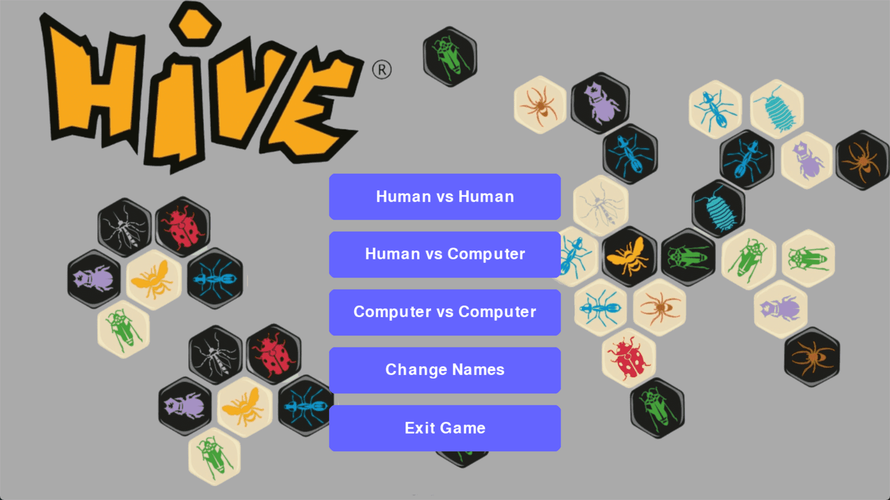

# Hive-Game

## Team Members

| Name                                    | ID      |
|-----------------------------------------|---------|
| Mark Ramy Fathy                         | 2000923 |
| Hossam Eid Ibrahim Abdallah             | 2001070 |
| Fawzy Mohamed Zaki Bashandy             | 2001070 |
| Seif alrahman Ahmed mohamed alfakharany | 2000421 |
| Seif gamal saeed                        | 2001572 |
| Ahmed Gamal Soliman                     | 2000204 |
| Heba Maher Abdelrahman                  | 2001400 |
| Mostafa Hesham Mohamed                  | 2001073 |
| Ahmed Mohamed Elsayed                    | 2000035 |

## Project Description
This Hive game project offers a dynamic gaming experience, supporting three distinct game modes: Human vs Human, Human vs Computer, and Computer vs Computer. Designed to challenge players of all skill levels, the AI features three difficulty settings: Easy, Medium, and Hard.

The AI is powered by sophisticated algorithms, including Minimax, Minimax with Alpha-Beta Pruning, and Iterative Deepening. These algorithms enable the AI to evaluate potential moves and make optimal decisions. The difficulty levels are determined by the AI's search depth:

- **Easy**: Minimax with Alpha-Beta Pruning (Depth 1) – Human always wins.
- **Medium**: Minimax with Alpha-Beta Pruning (Depth 2) – Offers a balanced challenge for intermediate players.
- **Hard**: Minimax with Alpha-Beta Pruning (Depth 3) – Computer always wins.

## Project Features
- **Board Display**: The game visually represents the current board state, including all pieces placed by both players. This ensures players have a clear and intuitive view of the game at all times.

- **Board Movement**: Players can reposition the game board by holding the right mouse button and dragging. This feature enhances user experience by allowing better visibility and accessibility, particularly on smaller screens or when focusing on specific areas of the board.

- **Move Input**: Human players can input moves by directly clicking on the desired positions on the board. The interface provides real-time feedback on valid and invalid moves, ensuring smooth and error-free interactions.

- **Game Status**: Displays vital information during gameplay, including:
  - The current score for both players.
  - Whose turn it is to play next.
  - Notifications for special game events such as completed rounds, invalid moves, or game end.
  - The final game result when the match concludes.
  - The ability to detect when a draw happens.

    
- **Game Modes**: Players can choose from the following game modes to suit their preferences:
  - **Human vs. Human**: Two players take turns on the same device.
  - **Human vs. Computer**: Play against the AI, with customizable difficulty settings.
  - **Computer vs. Computer**: Watch two AI players compete, useful for observing different AI strategies or testing configurations.

- **AI Difficulty Selection**: For games involving an AI player, users can choose from three difficulty levels:
  - **Easy**: AI searches only one level deep, focusing on immediate moves.
  - **Medium**: AI searches two levels deep, considering short-term strategies.
  - **Hard**: AI searches three levels deep for advanced decision-making and long-term planning.

    
- **Game Control**: Players can start a new game or restart the current game at any point. These options ensure flexibility, allowing players to experiment with strategies, game modes, or AI difficulties.

- **UX**: The ability to change the names of the players.

## Project Manual
### Main Menu

In the main menu, you can choose the game mode you want to play, the difficulty of the AI, and the names of the players.

### Human vs Human Mode

In this mode, you can play with another player on the same device. The player selects a piece, and the game will highlight the possible moves for that piece.

### Human vs Computer Mode

First you are asked to choose the level of difficulty of the AI, then you can play against the AI. 

Then the game starts where your oponent is the AI. 

### Computer vs Computer Mode

In this mode, you can watch two AI players compete against each other.

### Game Over

When the game ends, a message will appear to show the result of the game.

### Name changing

You can change the names of the players from the main menu.
